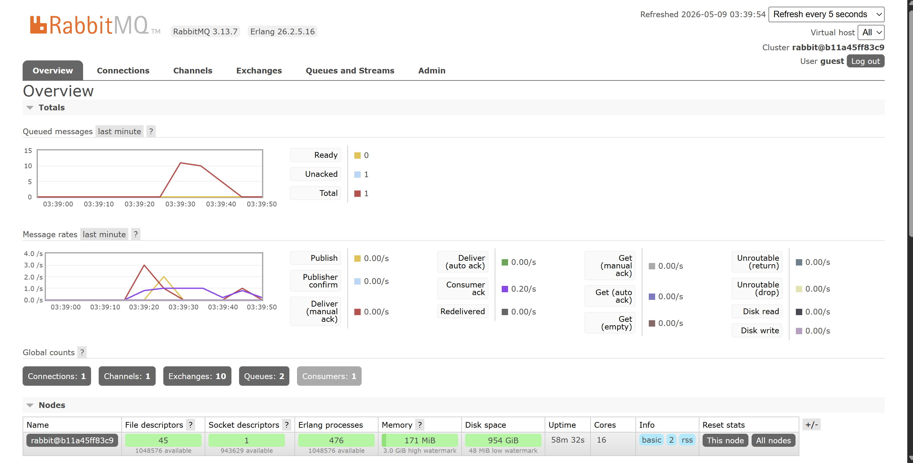
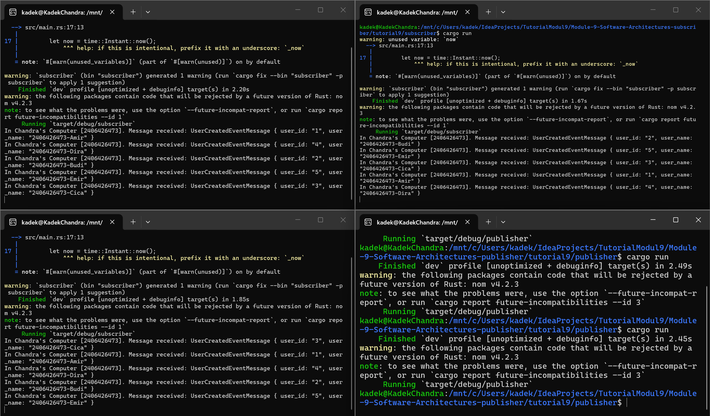
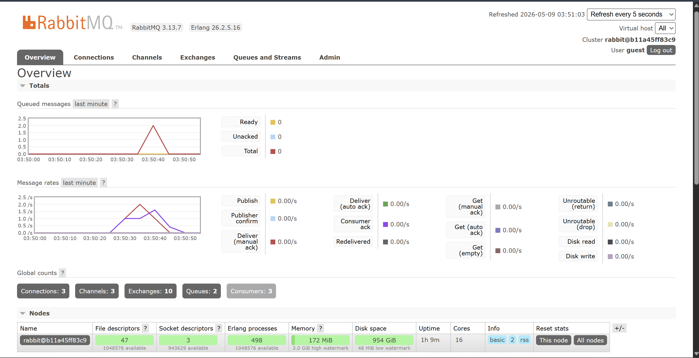

# Subscriber

## Understanding Subscriber and Message Broker

### a. What is AMQP?
AMQP (Advanced Message Queuing Protocol) adalah protokol komunikasi jaringan yang memungkinkan aplikasi untuk berkomunikasi satu sama lain melalui perantara pesan (message broker). AMQP mendefinisikan format pesan, antrian, dan cara pengiriman pesan secara standar, sehingga aplikasi yang dibuat dengan bahasa berbeda pun bisa saling bertukar pesan.

### b. What does guest:guest@localhost:5672 mean?
- **guest** (pertama) = username untuk login ke RabbitMQ
- **guest** (kedua)  = password untuk login ke RabbitMQ
- **localhost:5672** = alamat dan port tempat RabbitMQ berjalan.
localhost artinya RabbitMQ berjalan di komputer yang sama, dan 5672 adalah port default protokol AMQP pada RabbitMQ.

## Simulation Slow Subscriber
Setelah mengaktifkan `thread::sleep(ten_millis)`, subscriber membutuhkan waktu 1 detik untuk memproses setiap event. Ketika publisher dijalankan beberapa kali dengan cepat, event-event menumpuk di queue karena subscriber tidak mampu memproses secepat event masuk.

Pada mesin saya, jumlah queue yang menumpuk adalah 10 karena 2 kali menjalankan publisher × 5 event per run = 10 event,
dan subscriber baru selesai memproses satu per satu dengan delay 1 detik.

## Reflection and Running at Least Three Subscribers

Dengan menjalankan 3 subscriber sekaligus, pemrosesan event menjadi jauh lebih cepat. Event-event dari publisher dibagi secara merata ke subscriber yang tersedia (load balancing). Ini menunjukkan keunggulan event-driven architecture: kita bisa menambah subscriber (scale out) untuk meningkatkan throughput tanpa mengubah kode publisher sama sekali.

Dari kode publisher dan subscriber saat ini, ada beberapa hal yang bisa diperbaiki:
1. Publisher tidak memiliki mekanisme konfirmasi bahwa event berhasil diterima
2. Subscriber bisa dibuat lebih dinamis dalam menentukan jumlah thread worker
3. Koneksi URL broker bisa dikonfigurasi melalui environment variable agar lebih fleksibel

